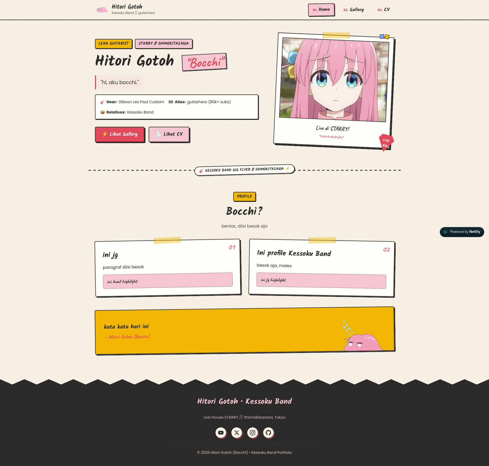
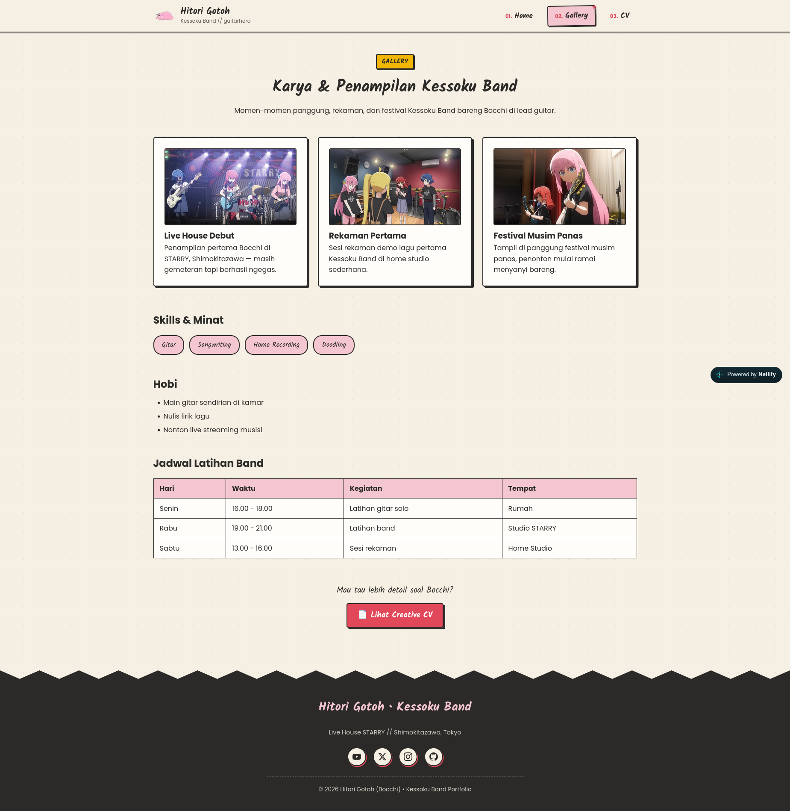
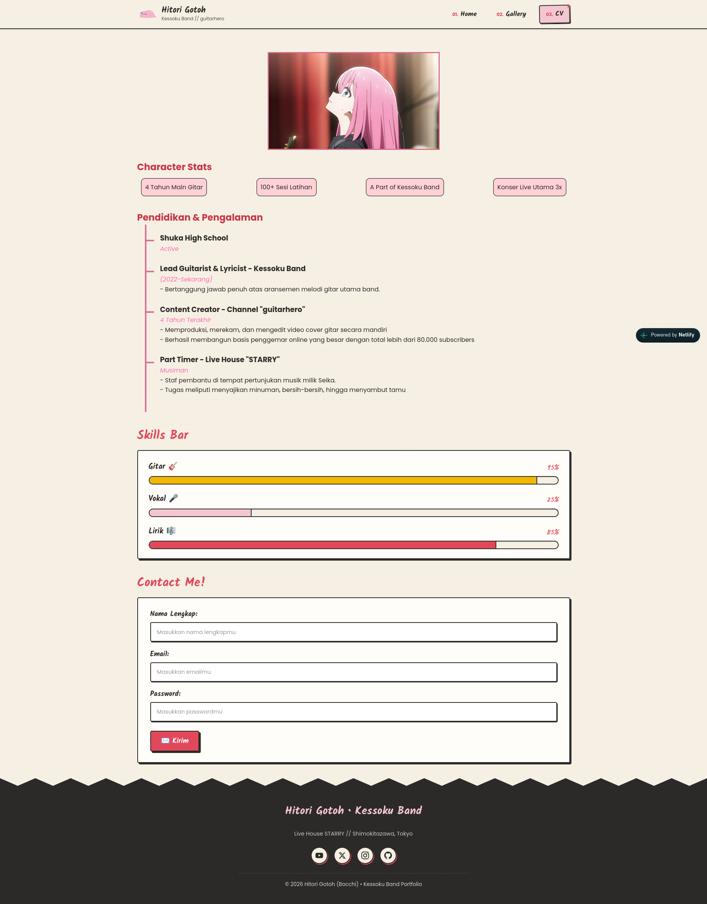

# Portfolio Website: Hitori Gotoh (Bocchi)

### Kelompok C12
> Nabila Sharliz Sigit (5027251054)\
> Catur Setyo Ragil (5027251066)\
> Nabila Nafisatus Zuhro (5027251073)

---

## Preview Tampilan

### 1. Landing Page (`index.html`)
Halaman utama yang memuat perkenalan singkat, hero section dengan foto polaroid interaktif, kartu profil Bocchi, serta banner kutipan dengan stiker animasi GIF transparan.



---

### 2. Gallery (`gallery.html`)
Menyajikan etalase karya dan dokumentasi penampilan panggung Kessoku Band dalam format kartu interaktif, pill minat/skills, serta tabel jadwal latihan band.



---

### 3. Creative CV (`cv.html`)
Menampilkan Curriculum Vitae kreatif dan interaktif yang mencakup ringkasan statistik karakter, lini masa (*timeline*) pengalaman dan pendidikan, bilah kemampuan (*skills bar*) dengan indikator persentase, serta formulir kontak interaktif.



---

## Fitur Utama

Website ini dibangun murni menggunakan **HTML5 semantik** dan **CSS3 modern** dengan beberapa fitur nilai tambah:

1. **Native from Scratch (No Framework)**
   * Dibuat 100% murni tanpa Tailwind, Bootstrap, atau library UI lainnya.
2. **Desain Responsif Penuh (*Fully Responsive*)**
   * Menggunakan CSS Flexbox, CSS Grid, dan Media Queries untuk menyesuaikan tata letak pada layar **Desktop**, **Tablet ($\le 768\text{px}$)**, dan **Mobile Smartphone ($\le 480\text{px}$)**.
3. **Pure CSS Hamburger Navigation (No JavaScript)**
   * Menu navigasi responsif pada perangkat mobile dibangun murni menggunakan teknik *checkbox hack* (`#menu-toggle:checked ~ .nav-links`) tanpa sebaris kode JavaScript pun.
4. **Efek Kertas Sobek (*Torn Paper Edge*)**
   * Menggunakan `clip-path: polygon(...)` dinamis untuk menghasilkan efek gerigi sobekan kertas yang menyatu mulus di atas footer pada setiap halaman.
5. **Komponen Scrapbook Neo-Brutalis Custom**
   * Stempel angka transparan (`.stamp`), stiker selotip miring (`.tape`), kartu polaroid dengan pin pick gitar, dan tombol 3D offset lift saat di-hover.

---

## Struktur Repo

```text
pweb-html_css-c12-2026/
├── assets/
│   ├── icons/
│   │   ├── github.svg
│   │   ├── instagram.svg
│   │   ├── tsuchinoko-bocchi.png
│   │   ├── twitter.svg
│   │   └── youtube.svg
│   ├── images/
│   │   ├── bocchi.gif
│   │   ├── bocchi-profile.webp
│   │   ├── first-record.avif
│   │   ├── school-concert.jpg
│   │   ├── school-concert_2.webp
│   │   └── starry-first-live.jpg
│   └── screenshots/
│       ├── cv.png
│       ├── gallery.png
│       └── landing-page.png
├── css/
│   └── style.css
├── cv.html
├── gallery.html
├── index.html
└── README.md
```

---

Live website: https://kamisukabocchi.netlify.app/